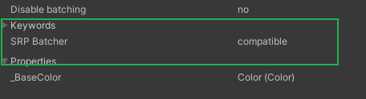
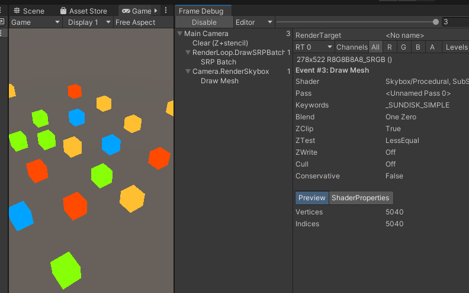

# 可编程渲染管线

本篇内容素材流程整理自 

[cakelikecoding]: https://catlikecoding.com/unity/tutorials/custom-srp

由于原文英语语义环境区别，我会整理出我理解的管线流程。


## 准备

1. 创建带有 urp package的 项目。

可以在创建项目的时候直接选择` 2D(URP) / 3D(URP) `项目 ，也可以创建项目后在`PackageManager`中安装`urp`的`pacakge`

2. 在场景中添加一些透明 / 不透明的物体。随意摆放就好。

   透明材质可以使用这张纹理贴图

   

最后结果

不透明材质设置:


透明材质设置:


 再创建个带有标准材质的物体：


最后场景中随意摆放的效果如下:


## 自定义渲染管线流程

### 创建管线资产

使用自定义流程，构建最基础的渲染管线

unity默认使用的是 builtin(内置渲染管线)，可以通过创建自定义的渲染Asset来创建自定义管线。这个Asset资产可以理解为对渲染方式的包装序列化成`ScriptableObject`,方便在unity中可视化切换。


```csharp
using System.Collections;
using System.Collections.Generic;
using UnityEngine;
using UnityEngine.Rendering;

//通过Rendering/Custom Render Pipeline菜单创建 Asset文件
[CreateAssetMenu(menuName = "Rendering/Custom Render Pipeline")]
public class CustomRenderPipelineAsset : RenderPipelineAsset
{
    protected override RenderPipeline CreatePipeline()
    {
        //实际渲染对象是 CustomRenderPipeline的实例
        //Asset是对 实际渲染函数的包装
        return new CustomRenderPipeline();
    }
}
```

```csharp
using UnityEngine;
using UnityEngine.Rendering;

public class CustomRenderPipeline : RenderPipeline
{
    private CameraRenderer renderer = new CameraRenderer();

    protected override void Render(ScriptableRenderContext context, Camera[] cameras)
    {
        //可以针对不同的Camera设置不同的渲染方式，实例中只是简化成了同一个。项目中这里可以扩展出更多Render类型
        foreach (var camera in cameras)
        {
            renderer.Render(context, camera);
        }
    }
}
```

```csharp
/*************************************************************************************
 *
 * 文 件 名:   CameraRenderer.cs
 * 描    述: 
 * 
 * 创 建 者：  洪金敏 
 * 创建时间：  2023-01-16 18:47:18
*************************************************************************************/

using UnityEngine;
using UnityEngine.Rendering;

public partial class CameraRenderer
{
    ScriptableRenderContext context;

    Camera camera;
    
    /// <summary>
    /// 最终渲染方式
    /// </summary>
    /// <param name="context"></param>
    /// <param name="camera"></param>    
    public void Render(ScriptableRenderContext context, Camera camera)
    {
        this.context = context;
        this.camera = camera;
    }
}
```

创建完基础结构后，通过`Rendering/Custom Render Pipeline`菜单创建自己的`PipelineAsset`文件。并在`ProjectSetting中设置给管线`


因为渲染从没有设置的状态(内置渲染管线)切换成了自定义渲染管线。在自定义渲染管线中又什么代码都没写，所以场景中原来看得到的物体，现在都看不到了。其实他还在那里，只是没有渲染。

### CameraRenderer 中流程

1. #### Cull

   剔除看不见的物体，节约性能。

2. #### Setup

   设置CommandBuffer的基础信息 最后可以一次性提交给GPU

   > 什么是CommandBuffer?
   >
   > 通俗的来说就是CPU:(#`O′)喂你好,是GPU吗？快点醒醒我这里又有画画的任务了(Cpu调用GPU的次数),打一个比方比如上传很多文件到百度云或其他地方时,都会把它压缩到一个文件夹里,不会把它们分开上传(当然还有原因就是它们数据是相关,比如是主题的一套ico文件或软件的安装文件),排除这些和文件整合的原因,假设网速没有波动,分开传和压缩包,压缩包速度一定快很多的(不仅仅是因为压缩包更小),主要是每次上传还有一些预备动作(比如与服务器链接,初始化Socket等等),细心的会发现文件当拖动到百度云会有几毫秒的延迟。其实优化DrawCall主要是Cpu的处理速度的优化,Cpu和GPU是并行工作的,处理的方式有一个命令缓存区.
   >
   > 实际上Cpu才是拖后腿的那个,现实中GPU早就把命令缓存区里命令都处理完毕了,Cpu确还在准备DrawCall的命令,Cpu通过图像编程接口向命令缓存区添加命令,而GPU通过缓存区获取命令处理。这个缓冲区就是CommandBuffer.
   >
   > <font color="#feed33">在每次调用DrawCall之前,因为Cpu需要向Gpu发送很多内容,包括数据、状态和命令,在这个阶段Cpu需要完成很多工作,比如检查渲染状态等(有一堆工作要Cpu处理,才会存放到缓存区),存放到缓存区以后,Gpu就要开始工作了,Gpu渲染能力还是很强的,渲染200或2000个三角网格通常看不出区别,导致Gpu渲染速度大于Cpu的提交速度,影响渲染流水线速度就是提交比较慢的Cpu</font>(现在知道玩游戏要买的电脑配置了吧,一般选择Cpu比较好的,Gpu一般的即可,当然游戏画面特别好的,还是建议把显卡买好点的,有些游戏硬性条件普通显卡根本渲染不了,并不是渲染速度的问题了),最后可想而知Cpu会花费大量的时间在提交DrawCall的路上,造成Cpu的过载,Gpu确会出现空闲。

3. #### DrawVisibleGeometry

   绘制可见物体

4. #### DrawUnsupportedShaders

   因为URP需要指定的Shader类型支持，一些旧的Shader比如前向渲染等是不支持的，使用了不支持Shader的物体显示成Unity传统的<font color="#e4007f">洋红色 ( Magenta )</font>

5. DrawGizmo

   URP中摄像机的视锥体等Gizmo需要自己绘制。

6. #### Submit

   提交给GPU执行绘制。这里才是最后提交给GPU画画的命令。

```c#
    // 扩展下函数调用
     public string SampleName { get; set; }

     public void Render(ScriptableRenderContext context, Camera camera)
     {
        this.context = context;
        this.camera = camera;
		//准备buffer空间
     	PrepareBuffer();
        if (!Cull())
        {
            return;
        }

        Setup();
        DrawVisibleGeometry();
        DrawUnsupportedShaders();
        DrawGizmo();
        //需要显卡配合 绘制一次 一次draw call
        Submit();
	}

    private void Setup()
    {	
        //清理render target 。。屏幕 、 rt --> framebuffer
        buffer.ClearRenderTarget(
            true,
            true,
            Color.clear);
        buffer.BeginSample(SampleName);
        ExecuteBuffer();
    }

    private void Submit()
    {
        buffer.EndSample(SampleName);
        ExecuteBuffer();
        context.Submit();
    }

    private partial void PrepareBuffer()
    {
        //取camera.name 会有78b的GC 所以正式环境不取
         Profiler.BeginSample("Editor Only");
         buffer.name = SampleName = camera.name;
         Profiler.EndSample();
    }

    private void ExecuteBuffer()
    {
          //把buffer中的命令 放到context中 用于后续commit到GPU
          context.ExecuteCommandBuffer(buffer);
          buffer.Clear();
    }
```

#### 流程：

CPU准备各种绘制命令 ->  CommandBuffer中 -> 拷贝进 ScriptableRenderContext -> context commit给GPU


## 开始渲染

### 绘制天空盒

我们需要把摄像机上设置的属性（比如 位置、FOV、正交、透视等）传递给context.

```c#
private void Setup()
{
   //读取摄像机上设置的属性矩阵 unity_MatrixVP  摄像机位置 角度 正交/透视参数 
   context.SetupCameraProperties(camera);
   ExecuteBuffer();
}

private void DrawVisibleGeometry()
{
     context.DrawSkybox(camera);
}
```


回到Unity，发现天空盒出现了，调整摄像机的旋转等参数也会跟着生效。


### 绘制实体

```csharp
	static ShaderTagId unlitShaderTagId = new ShaderTagId("SRPDefaultUnlit");

	private void DrawVisibleGeometry()
    {
        //确定是否应用正交排序或基于距离的排序
        var sortingSetting = new SortingSettings(camera);
        //指出允许使用哪种着色器通道
        var drawingSettings = new DrawingSettings(unlitShaderTagId, sortingSetting);
        //指出允许哪些渲染队列
        var filteringSettings = new FilteringSettings(RenderQueueRange.all);
        
        context.DrawRenderers(
            cullingResults, ref drawingSettings, ref filteringSettings
        );

        context.DrawSkybox(camera);
    }
```


好像哪里不对？

1. 不透明度物体正确的画了出来，但是透明物体背后如果没有物体的区域都被裁切了。
2. 使用Standard标准材质的Cube没有被渲染出来 （这个问题后续解决）

来到FrameDebug看下


发现在绘制天空盒之前，透明物体都是正常显示的。

Why?

查看调用顺序。Render中先渲染了全部的物体，再画天空盒。因为透明物体关闭了ZWrite（透明物体不能真覆盖背后的物体），在画天空盒的时候，天空的深度当然比没有透明物体的没有写入深度的地方大，所以像素被覆盖了。

修改下

```csharp
 private void DrawVisibleGeometry()
    {
        //确定是否应用正交排序或基于距离的排序
        var sortingSetting = new SortingSettings(camera);
        //指出允许使用哪种着色器通道
        var drawingSettings = new DrawingSettings(unlitShaderTagId, sortingSetting);
        //指出允许哪些渲染队列
        var filteringSettings = new FilteringSettings(RenderQueueRange.opaque);
        
        context.DrawRenderers(
            cullingResults, ref drawingSettings, ref filteringSettings
        );

        context.DrawSkybox(camera);

        sortingSetting.criteria = SortingCriteria.CommonTransparent;
        drawingSettings.sortingSettings = sortingSetting;
        filteringSettings.renderQueueRange = RenderQueueRange.transparent;
        
        context.DrawRenderers(
            cullingResults, ref drawingSettings, ref filteringSettings
        );
    }
```


### Cull

剔除不需要渲染的物体很简单，直接调用Unity提供的API就好

```csharp
    private bool Cull()
    {
        ScriptableCullingParameters p;
        if (camera.TryGetCullingParameters(out p))
        {
            //有内容可以显示
            cullingResults = context.Cull(ref p);
            return true;
        }

        return false;
    }
```


### 绘制不支持渲染的物体

```csharp
    private static Material errorMaterial;

	//不支持的旧的Shader Tag
    static ShaderTagId[] legacyShaderTagIds =
    {
        new ShaderTagId("Always"),
        new ShaderTagId("ForwardBase"),
        new ShaderTagId("PrepassBase"),
        new ShaderTagId("Vertex"),
        new ShaderTagId("VertexLMRGBM"),
        new ShaderTagId("VertexLM")
    };

	private partial void DrawUnsupportedShaders()
    {
        if (errorMaterial == null)
        {
            errorMaterial =
                new Material(Shader.Find("Hidden/InternalErrorShader"));
        }

        var drawingSettings = new DrawingSettings(
            legacyShaderTagIds[0], new SortingSettings(camera)
        );
        drawingSettings.overrideMaterial = errorMaterial;

        for (int i = 1; i < legacyShaderTagIds.Length; i++)
        {
            drawingSettings.SetShaderPassName(i, legacyShaderTagIds[i]);
        }
		
        //这里随便创建个Setting就好，不存在什么过滤
        var filteringSettings = new FilteringSettings(RenderQueueRange.all);
        context.DrawRenderers(cullingResults, ref drawingSettings, ref filteringSettings);
    }
```


洋红色的错误出现了

### DrawGizmo

这时候渲染的主体已经大致可用了，剩下一些细节性的还原。点击摄像机会发现Scene中没有显示熟悉的视锥或者正交矩形。

```c#
    private partial void DrawGizmo()
    {
        //不加判断会发现Game窗口下也有Gizmos
        if (Handles.ShouldRenderGizmos())
        {
            context.DrawGizmos(camera, GizmoSubset.PreImageEffects);
            context.DrawGizmos(camera, GizmoSubset.PostImageEffects);
        }
    }
```


### PrepareForSceneWindow

在场景上创建个UGUI控件，会发现Game窗口中会显示，但是Scene里看不到。


打开Frame Debug 可以看出 UGUI是在另外一个渲染执行段中进行的，所以目前和我们写的管线不是在一起的。


```c#
    public void Render(ScriptableRenderContext context, Camera camera)
    {
        this.context = context;
        this.camera = camera;

        PrepareBuffer();
        PrepareForSceneWindow();
        ...
    }

  private partial void PrepareForSceneWindow()
    {
      	//摄像机是Scene对应的摄像机 这是个特殊的摄像机，用于拍摄Scene里看到的东西
        if (camera.cameraType == CameraType.SceneView)
        {
            //这句话没有特别明白含义 ~~~
            ScriptableRenderContext.EmitWorldGeometryForSceneView(camera);
        }
    }
```


### 还原Culling Layer


发现切换Culling Mask中的任何选项没有作用，回看代码可以看到

```c#
private void Setup()
{
    ...
    buffer.ClearRenderTarget(
            true,
            true,
            Color.clear);
    ...
}
```

这里还没有对Culling Mask、Clear Flags进行操作

```c#
var clearFlags = camera.clearFlags;
buffer.ClearRenderTarget(
    clearFlags <= CameraClearFlags.Depth,
    clearFlags == CameraClearFlags.Color,
    clearFlags == CameraClearFlags.Color ? camera.backgroundColor.linear: Color.clear);
```


好了。Done。一切正常。

代码都在这里：

> https://github.com/jonny91/CustomRenderPipeline.git


----------

# Draw Calls

## Shaders

<font color="#ff3283">**这将不会是一篇Step By Step的文章。提供给和我一样，之前有内置渲染管线Shader编写基础的同学阅读。**</font>

Mesh是CPU告诉GPU画什么

Shader是告诉GPU怎么画

Unity的可编程渲染管线可以使用`Shader Graph`来写`Shader`，但是这里会自己写代码来实现。这样可以充分理解Shader是如何工作的。

### 一个简单的Shader

这个Shader 纯手写，不使用Unity内置库

目录结构及Shader内容


```glsl
// Unlit.shader

Shader "Custom RP/Unlit"
{
    Properties {}

    SubShader
    {
        Pass
        {
            //内置管线使用 CGPROGRAM 
            //URP 使用 HLSLPROGRAM
            HLSLPROGRAM
            #pragma vertex UnlitPassVertex
			#pragma fragment UnlitPassFragment
            //把所有hlsl代码都放在这个文件中
            #include "UnlitPass.hlsl"
            ENDHLSL
        }
    }
}

```


因为没有使用Unity的库，所以申明一下用到的变量，防止语法报错

```glsl
// UnityInput.hlsl

#ifndef CUSTOM_UNITY_INPUT_INCLUDED
#define CUSTOM_UNITY_INPUT_INCLUDED

float4x4 unity_ObjectToWorld;
float4x4 unity_MatrixVP;

#endif

```

```glsl
// Common.hlsl

#ifndef CUSTOM_COMMON_INCLUDED
#define CUSTOM_COMMON_INCLUDED

#include "UnityInput.hlsl"

float3 TransformObjectToWorld(float3 positionOS)
{
    return mul(unity_ObjectToWorld, float4(positionOS, 1)).xyz;
}

float4 TransformWorldToHClip(float3 positionWS)
{
    return mul(unity_MatrixVP, float4(positionWS, 1.0));
}

#endif

```

```glsl
// UnlitPass.hlsl

// 和c一样 重复include 会造成代码重复 所以加个判断的宏
#ifndef CUSTOM_UNLIT_PASS_INCLUDED
#define CUSTOM_UNLIT_PASS_INCLUDED

#include "../ShaderLibrary/Common.hlsl"

float4 UnlitPassVertex(float3 positionOS:POSITION):SV_POSITION
{
    // https://zhuanlan.zhihu.com/p/261097735
    // 模型空间 -> 世界空间
    float3 positionWS = TransformObjectToWorld(positionOS.xyz);
    //世界空间 -> 视图空间 -> 投影空间
    return TransformWorldToHClip(float4(positionWS, 1));
}

float4 UnlitPassFragment():SV_TARGET
{
    return float4(0.6, 0.3, 0.2, 1);
}

#endif

```


最终效果


### 使用URP库替代

```glsl
// Common.hlsl

#ifndef CUSTOM_COMMON_INCLUDED
#define CUSTOM_COMMON_INCLUDED

#include "Packages/com.unity.render-pipelines.core/ShaderLibrary/Common.hlsl"
#include "UnityInput.hlsl"

// float3 TransformObjectToWorld(float3 positionOS)
// {
//     return mul(unity_ObjectToWorld, float4(positionOS, 1)).xyz;
// }
//
// float4 TransformWorldToHClip(float3 positionWS)
// {
//     return mul(unity_MatrixVP, float4(positionWS, 1.0));
// }

//SpaceTransforms 使用 UNITY_MATRIX_xxx矩阵
#define UNITY_MATRIX_M unity_ObjectToWorld
#define UNITY_MATRIX_I_M unity_WorldToObject
#define UNITY_MATRIX_V unity_MatrixV
#define UNITY_MATRIX_VP unity_MatrixVP
#define UNITY_MATRIX_P glstate_matrix_projection
#define UNITY_PREV_MATRIX_M   unity_MatrixPreviousM
#define UNITY_PREV_MATRIX_I_M unity_MatrixPreviousMI

#include "Packages/com.unity.render-pipelines.core/ShaderLibrary/SpaceTransforms.hlsl"

#endif

```

去除了自定义的`TransformObjectToWorld` 以及  `TransformWorldToHClip` 函数 用 Library库中的 内置函数代替

因为 `Packages/com.unity.render-pipelines.core/ShaderLibrary/SpaceTransforms.hlsl`内置库中很使用 `UNITY_MATRIX_XX`的矩阵宏，我们没有定义 所以补上定义。

```glsl
// UnityInput.hlsl

#ifndef CUSTOM_UNITY_INPUT_INCLUDED
#define CUSTOM_UNITY_INPUT_INCLUDED

#include "Packages/com.unity.render-pipelines.core/ShaderLibrary/Common.hlsl"

float4x4 unity_ObjectToWorld;
float4x4 unity_WorldToObject;
real4 unity_WorldTransformParams;

float4x4 unity_MatrixVP;
float4x4 unity_MatrixV;
float4x4 glstate_matrix_projection;

float4x4 unity_MatrixPreviousM;
float4x4 unity_MatrixPreviousMI;


#endif

```

以上原文中很多宏缺失，我参阅了源码补上了。

其实记不住这么多宏是干嘛的，翻阅了源码后发现 `BuiltIn`和 `URP`管线源码中都有`UnityInput.hlsl`的定义，其中定义了一样的宏，后面应该会提到。暂时照抄吧。简单来说就是Unity给出的一些变换矩阵，只是各种宏定义了不同的名字。

表现效果不变。


### 自定义属性

这一部分和`BuiltIn Shader`没什么区别，加个颜色参数看下表现

```glsl
// Unlit.shader

Shader "Custom RP/Unlit"
{
    Properties {
        _BaseColor("Color", Color) = (1,1,1,1)
    }

    SubShader
    {
        ...
    }
}

```

```glsl
// 和c一样 重复include 会造成代码重复 所以加个判断的宏
#ifndef CUSTOM_UNLIT_PASS_INCLUDED
#define CUSTOM_UNLIT_PASS_INCLUDED

#include "../ShaderLibrary/Common.hlsl"

float4 _BaseColor;

...
    
float4 UnlitPassFragment():SV_TARGET
{
    return _BaseColor;
}

#endif

```


同样可以在面板上自定义改变颜色

## Batching

每`Drawcall`调用都需要 CPU 和 GPU 之间的通信。如果CPU给GPU发送数据很多，那么很浪费时间。当 CPU 忙于发送数据时，它不能做其他事情。这两个问题都会降低帧速率。

> Every draw call requires communication between the CPU and GPU. If a lot of data has to be sent to the GPU then it might end up wasting time by waiting. And while the CPU is busy sending data it can't do other things. Both issues can lower the frame rate.

这部分原文讲的很好。所以放下原文。

在场景上放20个Cube


Frame Debug 显示绘制了22次。其中1次清除渲染目标 + 20次画Cube + 1次画天空盒。

Saving Batch 0次。

State面板里不包含Clear操作。


### SRP Batcher

srp batcher不会减少调用的数量，但是会使流程精简。他会在GPU上缓存材质的属性，所以CPU不用每次都发送了，减少了传输的数据，也减轻了CPU的工作。

现在 SRP Batcher 并没有生效，查看Shader对应的面板，上面有提示问题。


是我们Shader没有支持，修改下Shader

```glsl
// UnlitPass.hlsl

#ifndef CUSTOM_UNLIT_PASS_INCLUDED
#define CUSTOM_UNLIT_PASS_INCLUDED

#include "../ShaderLibrary/Common.hlsl"

// 不是所有平台都支持 常量缓冲区
// cbuffer UnityPerMaterial
// {
//     float4 _BaseColor;
// }

CBUFFER_START(UnityPerMaterial) 
    float4 _BaseColor;
CBUFFER_END

...

#endif
```

修改后发现还有问题


```glsl
// UnityInput.hlsl

CBUFFER_START(UnityPerDraw)
    float4x4 unity_ObjectToWorld;
    float4x4 unity_WorldToObject;
    float4 unity_LODFade;
    real4 unity_WorldTransformParams;
CBUFFER_END
```

```c#
// CustomRenderPipeline

    public CustomRenderPipeline()
    {
       GraphicsSettings.useScriptableRenderPipelineBatching = true;
    }
```

以上这些修改我其实不知道为什么，inspector面板上提示什么加什么。我理解的是 这些矩阵默认并不在 我们指定的 cbuffer中。




一顿操作后没问题了。



Frame Debug上显示 只有3次绘制了。其中20次 Cube 合并成了一次。