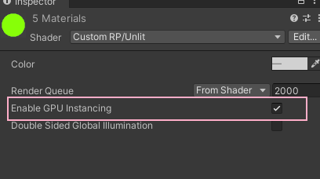
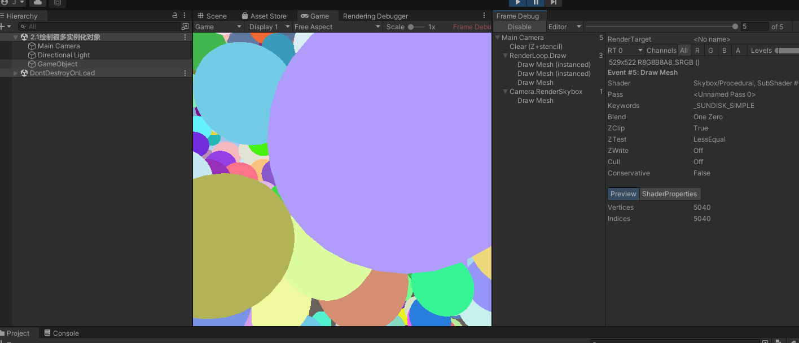

# 可编程渲染管线

本篇内容素材流程整理自 

[cakelikecoding]: https://catlikecoding.com/unity/tutorials/custom-srp

由于原文英语语义环境区别，我会整理出我理解的管线流程。


## 准备

1. 创建带有 urp package的 项目。

可以在创建项目的时候直接选择` 2D(URP) / 3D(URP) `项目 ，也可以创建项目后在`PackageManager`中安装`urp`的`pacakge`

2. 在场景中添加一些透明 / 不透明的物体。随意摆放就好。

   透明材质可以使用这张纹理贴图

   

最后结果

不透明材质设置:


透明材质设置:


 再创建个带有标准材质的物体：


最后场景中随意摆放的效果如下:


## 自定义渲染管线流程

### 创建管线资产

使用自定义流程，构建最基础的渲染管线

unity默认使用的是 builtin(内置渲染管线)，可以通过创建自定义的渲染Asset来创建自定义管线。这个Asset资产可以理解为对渲染方式的包装序列化成`ScriptableObject`,方便在unity中可视化切换。


```csharp
using System.Collections;
using System.Collections.Generic;
using UnityEngine;
using UnityEngine.Rendering;

//通过Rendering/Custom Render Pipeline菜单创建 Asset文件
[CreateAssetMenu(menuName = "Rendering/Custom Render Pipeline")]
public class CustomRenderPipelineAsset : RenderPipelineAsset
{
    protected override RenderPipeline CreatePipeline()
    {
        //实际渲染对象是 CustomRenderPipeline的实例
        //Asset是对 实际渲染函数的包装
        return new CustomRenderPipeline();
    }
}
```

```csharp
using UnityEngine;
using UnityEngine.Rendering;

public class CustomRenderPipeline : RenderPipeline
{
    private CameraRenderer renderer = new CameraRenderer();

    protected override void Render(ScriptableRenderContext context, Camera[] cameras)
    {
        //可以针对不同的Camera设置不同的渲染方式，实例中只是简化成了同一个。项目中这里可以扩展出更多Render类型
        foreach (var camera in cameras)
        {
            renderer.Render(context, camera);
        }
    }
}
```

```csharp
/*************************************************************************************
 *
 * 文 件 名:   CameraRenderer.cs
 * 描    述: 
 * 
 * 创 建 者：  洪金敏 
 * 创建时间：  2023-01-16 18:47:18
*************************************************************************************/

using UnityEngine;
using UnityEngine.Rendering;

public partial class CameraRenderer
{
    ScriptableRenderContext context;

    Camera camera;
    
    /// <summary>
    /// 最终渲染方式
    /// </summary>
    /// <param name="context"></param>
    /// <param name="camera"></param>    
    public void Render(ScriptableRenderContext context, Camera camera)
    {
        this.context = context;
        this.camera = camera;
    }
}
```

创建完基础结构后，通过`Rendering/Custom Render Pipeline`菜单创建自己的`PipelineAsset`文件。并在`ProjectSetting中设置给管线`


因为渲染从没有设置的状态(内置渲染管线)切换成了自定义渲染管线。在自定义渲染管线中又什么代码都没写，所以场景中原来看得到的物体，现在都看不到了。其实他还在那里，只是没有渲染。

### CameraRenderer 中流程

1. #### Cull

   剔除看不见的物体，节约性能。

2. #### Setup

   设置CommandBuffer的基础信息 最后可以一次性提交给GPU

   > 什么是CommandBuffer?
   >
   > 通俗的来说就是CPU:(#`O′)喂你好,是GPU吗？快点醒醒我这里又有画画的任务了(Cpu调用GPU的次数),打一个比方比如上传很多文件到百度云或其他地方时,都会把它压缩到一个文件夹里,不会把它们分开上传(当然还有原因就是它们数据是相关,比如是主题的一套ico文件或软件的安装文件),排除这些和文件整合的原因,假设网速没有波动,分开传和压缩包,压缩包速度一定快很多的(不仅仅是因为压缩包更小),主要是每次上传还有一些预备动作(比如与服务器链接,初始化Socket等等),细心的会发现文件当拖动到百度云会有几毫秒的延迟。其实优化DrawCall主要是Cpu的处理速度的优化,Cpu和GPU是并行工作的,处理的方式有一个命令缓存区.
   >
   > 实际上Cpu才是拖后腿的那个,现实中GPU早就把命令缓存区里命令都处理完毕了,Cpu确还在准备DrawCall的命令,Cpu通过图像编程接口向命令缓存区添加命令,而GPU通过缓存区获取命令处理。这个缓冲区就是CommandBuffer.
   >
   > <font color="#feed33">在每次调用DrawCall之前,因为Cpu需要向Gpu发送很多内容,包括数据、状态和命令,在这个阶段Cpu需要完成很多工作,比如检查渲染状态等(有一堆工作要Cpu处理,才会存放到缓存区),存放到缓存区以后,Gpu就要开始工作了,Gpu渲染能力还是很强的,渲染200或2000个三角网格通常看不出区别,导致Gpu渲染速度大于Cpu的提交速度,影响渲染流水线速度就是提交比较慢的Cpu</font>(现在知道玩游戏要买的电脑配置了吧,一般选择Cpu比较好的,Gpu一般的即可,当然游戏画面特别好的,还是建议把显卡买好点的,有些游戏硬性条件普通显卡根本渲染不了,并不是渲染速度的问题了),最后可想而知Cpu会花费大量的时间在提交DrawCall的路上,造成Cpu的过载,Gpu确会出现空闲。

3. #### DrawVisibleGeometry

   绘制可见物体

4. #### DrawUnsupportedShaders

   因为URP需要指定的Shader类型支持，一些旧的Shader比如前向渲染等是不支持的，使用了不支持Shader的物体显示成Unity传统的<font color="#e4007f">洋红色 ( Magenta )</font>

5. DrawGizmo

   URP中摄像机的视锥体等Gizmo需要自己绘制。

6. #### Submit

   提交给GPU执行绘制。这里才是最后提交给GPU画画的命令。

```c#
    // 扩展下函数调用
     public string SampleName { get; set; }

     public void Render(ScriptableRenderContext context, Camera camera)
     {
        this.context = context;
        this.camera = camera;
		//准备buffer空间
     	PrepareBuffer();
        if (!Cull())
        {
            return;
        }

        Setup();
        DrawVisibleGeometry();
        DrawUnsupportedShaders();
        DrawGizmo();
        //需要显卡配合 绘制一次 一次draw call
        Submit();
	}

    private void Setup()
    {	
        //清理render target 。。屏幕 、 rt --> framebuffer
        buffer.ClearRenderTarget(
            true,
            true,
            Color.clear);
        buffer.BeginSample(SampleName);
        ExecuteBuffer();
    }

    private void Submit()
    {
        buffer.EndSample(SampleName);
        ExecuteBuffer();
        context.Submit();
    }

    private partial void PrepareBuffer()
    {
        //取camera.name 会有78b的GC 所以正式环境不取
         Profiler.BeginSample("Editor Only");
         buffer.name = SampleName = camera.name;
         Profiler.EndSample();
    }

    private void ExecuteBuffer()
    {
          //把buffer中的命令 放到context中 用于后续commit到GPU
          context.ExecuteCommandBuffer(buffer);
          buffer.Clear();
    }
```

#### 流程：

CPU准备各种绘制命令 ->  CommandBuffer中 -> 拷贝进 ScriptableRenderContext -> context commit给GPU


## 开始渲染

### 绘制天空盒

我们需要把摄像机上设置的属性（比如 位置、FOV、正交、透视等）传递给context.

```c#
private void Setup()
{
   //读取摄像机上设置的属性矩阵 unity_MatrixVP  摄像机位置 角度 正交/透视参数 
   context.SetupCameraProperties(camera);
   ExecuteBuffer();
}

private void DrawVisibleGeometry()
{
     context.DrawSkybox(camera);
}
```


回到Unity，发现天空盒出现了，调整摄像机的旋转等参数也会跟着生效。


### 绘制实体

```csharp
	static ShaderTagId unlitShaderTagId = new ShaderTagId("SRPDefaultUnlit");

	private void DrawVisibleGeometry()
    {
        //确定是否应用正交排序或基于距离的排序
        var sortingSetting = new SortingSettings(camera);
        //指出允许使用哪种着色器通道
        var drawingSettings = new DrawingSettings(unlitShaderTagId, sortingSetting);
        //指出允许哪些渲染队列
        var filteringSettings = new FilteringSettings(RenderQueueRange.all);
        
        context.DrawRenderers(
            cullingResults, ref drawingSettings, ref filteringSettings
        );

        context.DrawSkybox(camera);
    }
```


好像哪里不对？

1. 不透明度物体正确的画了出来，但是透明物体背后如果没有物体的区域都被裁切了。
2. 使用Standard标准材质的Cube没有被渲染出来 （这个问题后续解决）

来到FrameDebug看下


发现在绘制天空盒之前，透明物体都是正常显示的。

Why?

查看调用顺序。Render中先渲染了全部的物体，再画天空盒。因为透明物体关闭了ZWrite（透明物体不能真覆盖背后的物体），在画天空盒的时候，天空的深度当然比没有透明物体的没有写入深度的地方大，所以像素被覆盖了。

修改下

```csharp
 private void DrawVisibleGeometry()
    {
        //确定是否应用正交排序或基于距离的排序
        var sortingSetting = new SortingSettings(camera);
        //指出允许使用哪种着色器通道
        var drawingSettings = new DrawingSettings(unlitShaderTagId, sortingSetting);
        //指出允许哪些渲染队列
        var filteringSettings = new FilteringSettings(RenderQueueRange.opaque);
        
        context.DrawRenderers(
            cullingResults, ref drawingSettings, ref filteringSettings
        );

        context.DrawSkybox(camera);

        sortingSetting.criteria = SortingCriteria.CommonTransparent;
        drawingSettings.sortingSettings = sortingSetting;
        filteringSettings.renderQueueRange = RenderQueueRange.transparent;
        
        context.DrawRenderers(
            cullingResults, ref drawingSettings, ref filteringSettings
        );
    }
```


### Cull

剔除不需要渲染的物体很简单，直接调用Unity提供的API就好

```csharp
    private bool Cull()
    {
        ScriptableCullingParameters p;
        if (camera.TryGetCullingParameters(out p))
        {
            //有内容可以显示
            cullingResults = context.Cull(ref p);
            return true;
        }

        return false;
    }
```


### 绘制不支持渲染的物体

```csharp
    private static Material errorMaterial;

	//不支持的旧的Shader Tag
    static ShaderTagId[] legacyShaderTagIds =
    {
        new ShaderTagId("Always"),
        new ShaderTagId("ForwardBase"),
        new ShaderTagId("PrepassBase"),
        new ShaderTagId("Vertex"),
        new ShaderTagId("VertexLMRGBM"),
        new ShaderTagId("VertexLM")
    };

	private partial void DrawUnsupportedShaders()
    {
        if (errorMaterial == null)
        {
            errorMaterial =
                new Material(Shader.Find("Hidden/InternalErrorShader"));
        }

        var drawingSettings = new DrawingSettings(
            legacyShaderTagIds[0], new SortingSettings(camera)
        );
        drawingSettings.overrideMaterial = errorMaterial;

        for (int i = 1; i < legacyShaderTagIds.Length; i++)
        {
            drawingSettings.SetShaderPassName(i, legacyShaderTagIds[i]);
        }
		
        //这里随便创建个Setting就好，不存在什么过滤
        var filteringSettings = new FilteringSettings(RenderQueueRange.all);
        context.DrawRenderers(cullingResults, ref drawingSettings, ref filteringSettings);
    }
```


洋红色的错误出现了

### DrawGizmo

这时候渲染的主体已经大致可用了，剩下一些细节性的还原。点击摄像机会发现Scene中没有显示熟悉的视锥或者正交矩形。

```c#
    private partial void DrawGizmo()
    {
        //不加判断会发现Game窗口下也有Gizmos
        if (Handles.ShouldRenderGizmos())
        {
            context.DrawGizmos(camera, GizmoSubset.PreImageEffects);
            context.DrawGizmos(camera, GizmoSubset.PostImageEffects);
        }
    }
```


### PrepareForSceneWindow

在场景上创建个UGUI控件，会发现Game窗口中会显示，但是Scene里看不到。


打开Frame Debug 可以看出 UGUI是在另外一个渲染执行段中进行的，所以目前和我们写的管线不是在一起的。


```c#
    public void Render(ScriptableRenderContext context, Camera camera)
    {
        this.context = context;
        this.camera = camera;

        PrepareBuffer();
        PrepareForSceneWindow();
        ...
    }

  private partial void PrepareForSceneWindow()
    {
      	//摄像机是Scene对应的摄像机 这是个特殊的摄像机，用于拍摄Scene里看到的东西
        if (camera.cameraType == CameraType.SceneView)
        {
            //这句话没有特别明白含义 ~~~
            ScriptableRenderContext.EmitWorldGeometryForSceneView(camera);
        }
    }
```


### 还原Culling Layer


发现切换Culling Mask中的任何选项没有作用，回看代码可以看到

```c#
private void Setup()
{
    ...
    buffer.ClearRenderTarget(
            true,
            true,
            Color.clear);
    ...
}
```

这里还没有对Culling Mask、Clear Flags进行操作

```c#
var clearFlags = camera.clearFlags;
buffer.ClearRenderTarget(
    clearFlags <= CameraClearFlags.Depth,
    clearFlags == CameraClearFlags.Color,
    clearFlags == CameraClearFlags.Color ? camera.backgroundColor.linear: Color.clear);
```


好了。Done。一切正常。

代码都在这里：

> https://github.com/jonny91/CustomRenderPipeline.git


----------

# Draw Calls

## Shaders

<font color="#ff3283">**这将不会是一篇Step By Step的文章。提供给和我一样，之前有内置渲染管线Shader编写基础的同学阅读。**</font>

Mesh是CPU告诉GPU画什么

Shader是告诉GPU怎么画

Unity的可编程渲染管线可以使用`Shader Graph`来写`Shader`，但是这里会自己写代码来实现。这样可以充分理解Shader是如何工作的。

### 一个简单的Shader

这个Shader 纯手写，不使用Unity内置库

目录结构及Shader内容


```glsl
// Unlit.shader

Shader "Custom RP/Unlit"
{
    Properties {}

    SubShader
    {
        Pass
        {
            //内置管线使用 CGPROGRAM 
            //URP 使用 HLSLPROGRAM
            HLSLPROGRAM
            #pragma vertex UnlitPassVertex
			#pragma fragment UnlitPassFragment
            //把所有hlsl代码都放在这个文件中
            #include "UnlitPass.hlsl"
            ENDHLSL
        }
    }
}

```


因为没有使用Unity的库，所以申明一下用到的变量，防止语法报错

```glsl
// UnityInput.hlsl

#ifndef CUSTOM_UNITY_INPUT_INCLUDED
#define CUSTOM_UNITY_INPUT_INCLUDED

float4x4 unity_ObjectToWorld;
float4x4 unity_MatrixVP;

#endif

```

```glsl
// Common.hlsl

#ifndef CUSTOM_COMMON_INCLUDED
#define CUSTOM_COMMON_INCLUDED

#include "UnityInput.hlsl"

float3 TransformObjectToWorld(float3 positionOS)
{
    return mul(unity_ObjectToWorld, float4(positionOS, 1)).xyz;
}

float4 TransformWorldToHClip(float3 positionWS)
{
    return mul(unity_MatrixVP, float4(positionWS, 1.0));
}

#endif

```

```glsl
// UnlitPass.hlsl

// 和c一样 重复include 会造成代码重复 所以加个判断的宏
#ifndef CUSTOM_UNLIT_PASS_INCLUDED
#define CUSTOM_UNLIT_PASS_INCLUDED

#include "../ShaderLibrary/Common.hlsl"

float4 UnlitPassVertex(float3 positionOS:POSITION):SV_POSITION
{
    // https://zhuanlan.zhihu.com/p/261097735
    // 模型空间 -> 世界空间
    float3 positionWS = TransformObjectToWorld(positionOS.xyz);
    //世界空间 -> 视图空间 -> 投影空间
    return TransformWorldToHClip(float4(positionWS, 1));
}

float4 UnlitPassFragment():SV_TARGET
{
    return float4(0.6, 0.3, 0.2, 1);
}

#endif

```


最终效果


### 使用URP库替代

```glsl
// Common.hlsl

#ifndef CUSTOM_COMMON_INCLUDED
#define CUSTOM_COMMON_INCLUDED

#include "Packages/com.unity.render-pipelines.core/ShaderLibrary/Common.hlsl"
#include "UnityInput.hlsl"

// float3 TransformObjectToWorld(float3 positionOS)
// {
//     return mul(unity_ObjectToWorld, float4(positionOS, 1)).xyz;
// }
//
// float4 TransformWorldToHClip(float3 positionWS)
// {
//     return mul(unity_MatrixVP, float4(positionWS, 1.0));
// }

//SpaceTransforms 使用 UNITY_MATRIX_xxx矩阵
#define UNITY_MATRIX_M unity_ObjectToWorld
#define UNITY_MATRIX_I_M unity_WorldToObject
#define UNITY_MATRIX_V unity_MatrixV
#define UNITY_MATRIX_VP unity_MatrixVP
#define UNITY_MATRIX_P glstate_matrix_projection
#define UNITY_PREV_MATRIX_M   unity_MatrixPreviousM
#define UNITY_PREV_MATRIX_I_M unity_MatrixPreviousMI

#include "Packages/com.unity.render-pipelines.core/ShaderLibrary/SpaceTransforms.hlsl"

#endif

```

去除了自定义的`TransformObjectToWorld` 以及  `TransformWorldToHClip` 函数 用 Library库中的 内置函数代替

因为 `Packages/com.unity.render-pipelines.core/ShaderLibrary/SpaceTransforms.hlsl`内置库中很使用 `UNITY_MATRIX_XX`的矩阵宏，我们没有定义 所以补上定义。

```glsl
// UnityInput.hlsl

#ifndef CUSTOM_UNITY_INPUT_INCLUDED
#define CUSTOM_UNITY_INPUT_INCLUDED

#include "Packages/com.unity.render-pipelines.core/ShaderLibrary/Common.hlsl"

float4x4 unity_ObjectToWorld;
float4x4 unity_WorldToObject;
real4 unity_WorldTransformParams;

float4x4 unity_MatrixVP;
float4x4 unity_MatrixV;
float4x4 glstate_matrix_projection;

float4x4 unity_MatrixPreviousM;
float4x4 unity_MatrixPreviousMI;


#endif

```

以上原文中很多宏缺失，我参阅了源码补上了。

其实记不住这么多宏是干嘛的，翻阅了源码后发现 `BuiltIn`和 `URP`管线源码中都有`UnityInput.hlsl`的定义，其中定义了一样的宏，后面应该会提到。暂时照抄吧。简单来说就是Unity给出的一些变换矩阵，只是各种宏定义了不同的名字。

表现效果不变。


### 自定义属性

这一部分和`BuiltIn Shader`没什么区别，加个颜色参数看下表现

```glsl
// Unlit.shader

Shader "Custom RP/Unlit"
{
    Properties {
        _BaseColor("Color", Color) = (1,1,1,1)
    }

    SubShader
    {
        ...
    }
}

```

```glsl
// 和c一样 重复include 会造成代码重复 所以加个判断的宏
#ifndef CUSTOM_UNLIT_PASS_INCLUDED
#define CUSTOM_UNLIT_PASS_INCLUDED

#include "../ShaderLibrary/Common.hlsl"

float4 _BaseColor;

...
    
float4 UnlitPassFragment():SV_TARGET
{
    return _BaseColor;
}

#endif

```


同样可以在面板上自定义改变颜色

## Batching

每`Drawcall`调用都需要 CPU 和 GPU 之间的通信。如果CPU给GPU发送数据很多，那么很浪费时间。当 CPU 忙于发送数据时，它不能做其他事情。这两个问题都会降低帧速率。

> Every draw call requires communication between the CPU and GPU. If a lot of data has to be sent to the GPU then it might end up wasting time by waiting. And while the CPU is busy sending data it can't do other things. Both issues can lower the frame rate.

这部分原文讲的很好。所以放下原文。

在场景上放20个Cube


Frame Debug 显示绘制了22次。其中1次清除渲染目标 + 20次画Cube + 1次画天空盒。

Saving Batch 0次。

State面板里不包含Clear操作。


### SRP Batcher

srp batcher不会减少调用的数量，但是会使流程精简。他会在GPU上缓存材质的属性，所以CPU不用每次都发送了，减少了传输的数据，也减轻了CPU的工作。

现在 SRP Batcher 并没有生效，查看Shader对应的面板，上面有提示问题。


是我们Shader没有支持，修改下Shader

```glsl
// UnlitPass.hlsl

#ifndef CUSTOM_UNLIT_PASS_INCLUDED
#define CUSTOM_UNLIT_PASS_INCLUDED

#include "../ShaderLibrary/Common.hlsl"

// 不是所有平台都支持 常量缓冲区
// cbuffer UnityPerMaterial
// {
//     float4 _BaseColor;
// }

CBUFFER_START(UnityPerMaterial) 
    float4 _BaseColor;
CBUFFER_END

...

#endif
```

修改后发现还有问题


```glsl
// UnityInput.hlsl

CBUFFER_START(UnityPerDraw)
    float4x4 unity_ObjectToWorld;
    float4x4 unity_WorldToObject;
    float4 unity_LODFade;
    real4 unity_WorldTransformParams;
CBUFFER_END
```

```c#
// CustomRenderPipeline

    public CustomRenderPipeline()
    {
       GraphicsSettings.useScriptableRenderPipelineBatching = true;
    }
```

以上这些修改我其实不知道为什么，inspector面板上提示什么加什么。我理解的是 这些矩阵默认并不在 我们指定的 cbuffer中。


一顿操作后没问题了。


Frame Debug上显示 只有3次绘制了。其中20次 Cube 合并成了一次。


### 很多颜色

上面案例中设置了4个颜色 对应4个材质。他们合批到了一起。但是很多情况下不可能为每个颜色单独设置材质球，一般都是靠代码来控制的，所以做个测试。

写个脚本

```csharp
/*************************************************************************************
 *
 * 文 件 名:   PerObjectMaterialProperties.cs
 * 描    述: 
 * 
 * 创 建 者：  洪金敏 
 * 创建时间：  2023-01-20 20:28:04
*************************************************************************************/

using UnityEngine;
using Random = UnityEngine.Random;

[DisallowMultipleComponent]
public class PerObjectMaterialProperties : MonoBehaviour
{
    static int baseColorId = Shader.PropertyToID("_BaseColor");
    static MaterialPropertyBlock block;

    private void Awake()
    {
        OnValidate();
        // ClearBlock();
    }

    void OnValidate()
    {
        if (block == null)
        {
            block = new MaterialPropertyBlock();
        }

        block.SetColor(baseColorId, new Color(Random.value, Random.value, Random.value, 1));
        GetComponent<Renderer>().SetPropertyBlock(block);
    }

    public void ClearBlock()
    {
        if (block != null)
        {
            block.Clear();
        }
    }
}
```

挂载到10个Cube上，脚本会给材质球对应的Shader Block设置随机的颜色。


测试发现，没有挂脚本的Cube和之前一样合批了，但是修改过Block的 0 ~ 9 的10个cube 并没有合批。


## GPU实例化

还有一种合批的方式，叫GPU实例化。

通过一次为具有相同网格的多个对象发出单个Draw Call。CPU 收集所有每个对象的变换和材质属性，并将它们放入发送到 GPU 的数组中。然后 GPU 遍历所有条目并按照提供的顺序呈现它们。

```glsl
...
            //内置管线使用 CGPROGRAM 
            //URP 使用 HLSLPROGRAM
            HLSLPROGRAM
            #pragma multi_compile_instancing
            #pragma vertex UnlitPassVertex
			#pragma fragment UnlitPassFragment
            //把所有hlsl代码都放在这个文件中
            #include "UnlitPass.hlsl"
            ENDHLSL
...
```

shader 面板中会多出GPU Instancing的选项，全部勾上。



这个操作会让Shader产生两种变体。

1. 使用GPU Instancing支持
2. 不支持GPU Instancing


```glsl
// UnlitPass.hlsl

// 和c一样 重复include 会造成代码重复 所以加个判断的宏
#ifndef CUSTOM_UNLIT_PASS_INCLUDED
#define CUSTOM_UNLIT_PASS_INCLUDED

#include "../ShaderLibrary/Common.hlsl"

// 不是所有平台都支持 常量缓冲区
// cbuffer UnityPerMaterial
// {
//     float4 _BaseColor;
// }

// CBUFFER_START(UnityPerMaterial) 
//     float4 _BaseColor;
// CBUFFER_END

UNITY_INSTANCING_BUFFER_START(UnityPerMaterial)
    UNITY_DEFINE_INSTANCED_PROP(float4, _BaseColor)
UNITY_INSTANCING_BUFFER_END(UnityPerMaterial)

struct Attributes
{
    float3 positionOS: POSITION;
    // 会根据是否支持 GPU INSTANCE 来添加 attribute
    UNITY_VERTEX_INPUT_INSTANCE_ID
};

struct Varyings {
    float4 positionCS : SV_POSITION;
    UNITY_VERTEX_INPUT_INSTANCE_ID
};

Varyings  UnlitPassVertex(Attributes input)
{
    Varyings output;
    UNITY_SETUP_INSTANCE_ID(input);
    UNITY_TRANSFER_INSTANCE_ID(input, output);
    float3 positionWS = TransformObjectToWorld(input.positionOS);
    output.positionCS = TransformWorldToHClip(positionWS);
    return output;
}

float4 UnlitPassFragment (Varyings input) : SV_TARGET {
    UNITY_SETUP_INSTANCE_ID(input);
    return UNITY_ACCESS_INSTANCED_PROP(UnityPerMaterial, _BaseColor);
}

#endif

```

修改的内容实际上就是调用Unity其他的宏定义函数，把顶点数据放进数组/从数组里取数据。


GPU Instance只会对材质相同的进行合批处理。


## 绘制很多实例化对象

这是一个GPU Instance的应用。场景中有很多对象。

```c#
using UnityEngine;

public class MeshBall : MonoBehaviour
{
    static int baseColorId = Shader.PropertyToID("_BaseColor");

    [SerializeField]
    Mesh mesh = default;

    [SerializeField]
    Material material = default;

    Matrix4x4[] matrices = new Matrix4x4[1023];
    Vector4[] baseColors = new Vector4[1023];

    MaterialPropertyBlock block;

    void Awake()
    {
        for (int i = 0; i < matrices.Length; i++)
        {
            matrices[i] = Matrix4x4.TRS(
                Random.insideUnitSphere * 10f, Quaternion.identity, Vector3.one
            );
            baseColors[i] =
                new Vector4(Random.value, Random.value, Random.value, 1f);
        }
    }

    void Update()
    {
        if (block == null)
        {
            block = new MaterialPropertyBlock();
            block.SetVectorArray(baseColorId, baseColors);
        }

        Graphics.DrawMeshInstanced(mesh, 0, material, matrices, 1023, block);
    }
}
```

实例中 把1023个球 位置、颜色属性一桶防盗block中，一起调用绘制。



可以看到只绘制了3次。

> 原文中解释：
>
> 它需要多少次绘制调用取决于平台，因为每个绘制调用的最大缓冲区大小不同。在我的例子中，渲染需要三个绘制调用。

请注意，各个网格的绘制顺序与我们提供数据的顺序相同。除此之外没有任何类型的排序或剔除，尽管整个批次一旦超出视锥体就会消失。

## 动态合批

还有第三种减少绘制调用的方法，称为动态批处理。这是一种古老的技术，它将共享相同材质的多个小网格组合成一个更大的网格，然后一起绘制。动态合批适用于小网格。

如果要看效果需要禁用 SRP Batcher.

```c#
//CameraRenderer
var drawingSettings = new DrawingSettings(
			unlitShaderTagId, sortingSettings
		) {
			enableDynamicBatching = true,
			enableInstancing = false
		};


//CustomRenderPipeline
GraphicsSettings.useScriptableRenderPipelineBatching = false;
```


一般来说，GPU 实例化比动态批处理效果更好。


## Batch可配置

上面说了这么多的优化方法，不同情况下会使用不同的方式。所以我们要改成可配置。

在自定义管线Render中添加对应的bool开关，CameraRenderer -> CustomRenderPipeline -> CustomRenderPipelineAsset 一直加到最顶层用于用户控制。

```csharp
//CameraRenderer

  /// <summary>
    /// 最终渲染方式
    /// </summary>
    /// <param name="context"></param>
    /// <param name="camera"></param>
    /// <param name="useDynamicBatching"></param>
    /// <param name="useGPUInstancing"></param>
    public void Render(ScriptableRenderContext context, Camera camera, bool useDynamicBatching, bool useGPUInstancing)
    {
        ...
        DrawVisibleGeometry(useDynamicBatching, useGPUInstancing);
		...
    }

 private void DrawVisibleGeometry(bool useDynamicBatching, bool useGPUInstancing)
    {
        ...
        //指出允许使用哪种着色器通道
        var drawingSettings = new DrawingSettings(unlitShaderTagId, sortingSetting)
        {
            enableInstancing = useGPUInstancing,
            enableDynamicBatching = useDynamicBatching,
        };
      ...
    }

```


```csharp
// CustomRenderPipeline

public class CustomRenderPipeline : RenderPipeline
{
    private readonly bool _useDynamicBatching;
    private readonly bool _useGPUInstancing;
    private CameraRenderer renderer = new CameraRenderer();

    public CustomRenderPipeline(bool useDynamicBatching, bool useGPUInstancing, bool useSRPBatcher)
    {
        _useDynamicBatching = useDynamicBatching;
        _useGPUInstancing = useGPUInstancing;
        GraphicsSettings.useScriptableRenderPipelineBatching = useSRPBatcher;
    }

    protected override void Render(ScriptableRenderContext context, Camera[] cameras)
    {
        //可以针对不同的Camera设置不同的渲染方式，实例中只是简化成了同一个。项目中这里可以扩展出更多Render类型
        foreach (var camera in cameras)
        {
            renderer.Render(context, camera, _useDynamicBatching, _useGPUInstancing);
        }
    }
}
```

```csharp
[CreateAssetMenu(menuName = "Rendering/Custom Render Pipeline")]
public class CustomRenderPipelineAsset : RenderPipelineAsset
{
    [SerializeField]
    bool useDynamicBatching = true, useGPUInstancing = true, useSRPBatcher = true;

    protected override RenderPipeline CreatePipeline()
    {
        //实际渲染对象是 CustomRenderPipeline的实例
        //Asset是对 实际渲染函数的包装
        return new CustomRenderPipeline(useDynamicBatching, useGPUInstancing, useSRPBatcher);
    }
}
```

修改后RP Asset面板上就能直接控制了


## 扩展Shader

### 透明度

修改 Unlit Shader 支持透明材质

```glsl
Shader "Custom RP/Unlit"
{
    Properties
    {
        _BaseColor("Color", Color) = (1,1,1,1)
        [Enum(UnityEngine.Rendering.BlendMode)] _SrcBlend ("Src Blend", Float) = 1
        [Enum(UnityEngine.Rendering.BlendMode)] _DstBlend ("Dst Blend", Float) = 0
        [Enum(Off, 0, On, 1)] _ZWrite ("Z Write", Float) = 1
    }

    SubShader
    {
        Pass
        {
            Blend [_SrcBlend] [_DstBlend]
            ZWrite [_ZWrite]
            //内置管线使用 CGPROGRAM 
            //URP 使用 HLSLPROGRAM
            HLSLPROGRAM
            #pragma multi_compile_instancing
            #pragma vertex UnlitPassVertex
            #pragma fragment UnlitPassFragment
            //把所有hlsl代码都放在这个文件中
            #include "UnlitPass.hlsl"
            ENDHLSL
        }
    }
}
```

这部分逻辑和内置渲染管线相同，设置Blend混合模式、关闭ZWrite、把渲染队列调整到透明队列中。


### 纹理贴图

```glsl
// Custom RP/Unlit

Shader "Custom RP/Unlit"
{
    Properties
    {
        _BaseMap("Texture", 2D) = "white" {}
        _BaseColor("Color", Color) = (1,1,1,1)
        [Enum(UnityEngine.Rendering.BlendMode)] _SrcBlend ("Src Blend", Float) = 1
        [Enum(UnityEngine.Rendering.BlendMode)] _DstBlend ("Dst Blend", Float) = 0
        [Enum(Off, 0, On, 1)] _ZWrite ("Z Write", Float) = 1
    }

    SubShader
    {
        Pass
        {
            Blend [_SrcBlend] [_DstBlend]
            ZWrite [_ZWrite]
            //内置管线使用 CGPROGRAM 
            //URP 使用 HLSLPROGRAM
            HLSLPROGRAM
            #pragma multi_compile_instancing
            #pragma vertex UnlitPassVertex
            #pragma fragment UnlitPassFragment
            //把所有hlsl代码都放在这个文件中
            #include "UnlitPass.hlsl"
            ENDHLSL
        }
    }
}
```

```glsl
// UnlitPass.hlsl

// 和c一样 重复include 会造成代码重复 所以加个判断的宏
#ifndef CUSTOM_UNLIT_PASS_INCLUDED
#define CUSTOM_UNLIT_PASS_INCLUDED

#include "../ShaderLibrary/Common.hlsl"

TEXTURE2D(_BaseMap);
SAMPLER(sampler_BaseMap);

UNITY_INSTANCING_BUFFER_START(UnityPerMaterial)
    UNITY_DEFINE_INSTANCED_PROP(float4, _BaseMap_ST)
    UNITY_DEFINE_INSTANCED_PROP(float4, _BaseColor)
UNITY_INSTANCING_BUFFER_END(UnityPerMaterial)

struct Attributes
{
    float3 positionOS: POSITION;
    float2 baseUV : TEXCOORD0;
    // 会根据是否支持 GPU INSTANCE 来添加 attribute
    UNITY_VERTEX_INPUT_INSTANCE_ID
};

struct Varyings {
    float4 positionCS : SV_POSITION;
    float2 baseUV : VAR_BASE_UV;
    UNITY_VERTEX_INPUT_INSTANCE_ID
};

Varyings  UnlitPassVertex(Attributes input)
{
    Varyings output;
    UNITY_SETUP_INSTANCE_ID(input);
    UNITY_TRANSFER_INSTANCE_ID(input, output);
    float3 positionWS = TransformObjectToWorld(input.positionOS);
    output.positionCS = TransformWorldToHClip(positionWS);
    float4 baseST = UNITY_ACCESS_INSTANCED_PROP(UnityPerMaterial, _BaseMap_ST);
    output.baseUV = input.baseUV * baseST.xy + baseST.zw;
    return output;
}

float4 UnlitPassFragment (Varyings input) : SV_TARGET {
    UNITY_SETUP_INSTANCE_ID(input);
    float4 baseMap = SAMPLE_TEXTURE2D(_BaseMap, sampler_BaseMap, input.baseUV);
    float4 baseColor = UNITY_ACCESS_INSTANCED_PROP(UnityPerMaterial, _BaseColor);
    return baseMap * baseColor;
}

#endif

```

### Alpha Clipping

像素值的结果比给定的小，则丢弃。

```glsl
Shader "Custom RP/Unlit"
{
    Properties
    {
        _BaseMap("Texture", 2D) = "white" {}
        _BaseColor("Color", Color) = (1,1,1,1)
        [Enum(UnityEngine.Rendering.BlendMode)] _SrcBlend ("Src Blend", Float) = 1
        [Enum(UnityEngine.Rendering.BlendMode)] _DstBlend ("Dst Blend", Float) = 0
        [Enum(Off, 0, On, 1)] _ZWrite ("Z Write", Float) = 1
        [Toggle(_CLIPPING)] _Clipping ("Alpha Clipping", Float) = 0
    }

    SubShader
    {
        Pass
        {
            Blend [_SrcBlend] [_DstBlend]
            ZWrite [_ZWrite]
            //内置管线使用 CGPROGRAM 
            //URP 使用 HLSLPROGRAM
            HLSLPROGRAM
            #pragma shader_feature _CLIPPING
            #pragma multi_compile_instancing
            #pragma vertex UnlitPassVertex
            #pragma fragment UnlitPassFragment
            //把所有hlsl代码都放在这个文件中
            #include "UnlitPass.hlsl"
            ENDHLSL
        }
    }
}
```

```glsl
// 和c一样 重复include 会造成代码重复 所以加个判断的宏
#ifndef CUSTOM_UNLIT_PASS_INCLUDED
#define CUSTOM_UNLIT_PASS_INCLUDED

#include "../ShaderLibrary/Common.hlsl"

// 不是所有平台都支持 常量缓冲区
// cbuffer UnityPerMaterial
// {
//     float4 _BaseColor;
// }

// CBUFFER_START(UnityPerMaterial) 
//     float4 _BaseColor;
// CBUFFER_END

TEXTURE2D(_BaseMap);
SAMPLER(sampler_BaseMap);

UNITY_INSTANCING_BUFFER_START(UnityPerMaterial)
    UNITY_DEFINE_INSTANCED_PROP(float4, _BaseMap_ST)
    UNITY_DEFINE_INSTANCED_PROP(float4, _BaseColor)
    UNITY_DEFINE_INSTANCED_PROP(float, _Cutoff)
UNITY_INSTANCING_BUFFER_END(UnityPerMaterial)

struct Attributes
{
    float3 positionOS: POSITION;
    float2 baseUV : TEXCOORD0;
    // 会根据是否支持 GPU INSTANCE 来添加 attribute
    UNITY_VERTEX_INPUT_INSTANCE_ID
};

struct Varyings {
    float4 positionCS : SV_POSITION;
    float2 baseUV : VAR_BASE_UV;
    UNITY_VERTEX_INPUT_INSTANCE_ID
};

Varyings  UnlitPassVertex(Attributes input)
{
    Varyings output;
    UNITY_SETUP_INSTANCE_ID(input);
    UNITY_TRANSFER_INSTANCE_ID(input, output);
    float3 positionWS = TransformObjectToWorld(input.positionOS);
    output.positionCS = TransformWorldToHClip(positionWS);
    float4 baseST = UNITY_ACCESS_INSTANCED_PROP(UnityPerMaterial, _BaseMap_ST);
    output.baseUV = input.baseUV * baseST.xy + baseST.zw;
    return output;
}

float4 UnlitPassFragment (Varyings input) : SV_TARGET {
    UNITY_SETUP_INSTANCE_ID(input);
    float4 baseMap = SAMPLE_TEXTURE2D(_BaseMap, sampler_BaseMap, input.baseUV);
    float4 baseColor = UNITY_ACCESS_INSTANCED_PROP(UnityPerMaterial, _BaseColor);
    float4 base = baseMap * baseColor;
    #if defined(_CLIPPING)
    clip(base.a - UNITY_ACCESS_INSTANCED_PROP(UnityPerMaterial, _Cutoff));
    #endif
    return base;
}

#endif

```

启用Clip时，shader_feature对应_CLIPPING 会打开，clip函数才会有效。

这样的话，unity将会把shader编译成 有/没有 _CLIPPING关键字的两份结果。 

## 补充

上面`Shader`中用了很多宏定义了，第一次读的时候有些懵。比如 

`TEXTURE2D(_BaseMap);
SAMPLER(sampler_BaseMap);`

查看源码后,在`URP common.hlsl`中有这样的定义

```glsl
// Include language header
#if defined (SHADER_API_GAMECORE)
#include "Packages/com.unity.render-pipelines.gamecore/ShaderLibrary/API/GameCore.hlsl"
#elif defined(SHADER_API_XBOXONE)
#include "Packages/com.unity.render-pipelines.xboxone/ShaderLibrary/API/XBoxOne.hlsl"
#elif defined(SHADER_API_PS4)
#include "Packages/com.unity.render-pipelines.ps4/ShaderLibrary/API/PSSL.hlsl"
#elif defined(SHADER_API_PS5)
#include "Packages/com.unity.render-pipelines.ps5/ShaderLibrary/API/PSSL.hlsl"
#elif defined(SHADER_API_D3D11)
#include "Packages/com.unity.render-pipelines.core/ShaderLibrary/API/D3D11.hlsl"
#elif defined(SHADER_API_METAL)
#include "Packages/com.unity.render-pipelines.core/ShaderLibrary/API/Metal.hlsl"
#elif defined(SHADER_API_VULKAN)
#include "Packages/com.unity.render-pipelines.core/ShaderLibrary/API/Vulkan.hlsl"
#elif defined(SHADER_API_SWITCH)
#include "Packages/com.unity.render-pipelines.core/ShaderLibrary/API/Switch.hlsl"
#elif defined(SHADER_API_GLCORE)
#include "Packages/com.unity.render-pipelines.core/ShaderLibrary/API/GLCore.hlsl"
#elif defined(SHADER_API_GLES3)
#include "Packages/com.unity.render-pipelines.core/ShaderLibrary/API/GLES3.hlsl"
#elif defined(SHADER_API_GLES)
#include "Packages/com.unity.render-pipelines.core/ShaderLibrary/API/GLES2.hlsl"
#else
#error unsupported shader api
#endif
```

随便看两个`hlsl`文件

```glsl
// D3D11.hlsl
#define TEXTURE2D(textureName)                Texture2D textureName
#define SAMPLER(samplerName)                  SamplerState samplerName
    
//GLES2.hlsl
#define TEXTURE2D(textureName)                  sampler2D textureName
#define SAMPLER(samplerName)
```

可以看出是根据不同平台的关键字不一样。

`GLES2`和之前的`builtin shader`的关键字一样，`sampler2D `申明纹理。`builtin`里没有` SamplerState`这东西，所以`GLES2` 里的实现是空语句。

> https://learn.microsoft.com/zh-tw/windows/win32/api/d3d11/nn-d3d11-id3d11samplerstate


在查询资料时， 发现一些shader 使用 `#ifdef` ，另一些使用`#if defined(XXX)`两种方式来判断关键字，有什么区别呢？

区别在于：

1. `#ifdef`只需要给出宏定义的名称，判断宏定义是否已经被定义过，如果已经定义过，则编译指定的代码块，否则跳过。
2. `#if defined(xx)`需要在括号中给出具体的宏定义名称，判断宏定义是否被定义过，并且其值是否为非零值（即宏定义是否为真），如果是，则编译指定的代码块，否则跳过。

因此，`#if defined(xx)`可以在宏定义被定义但值为0时跳过特定的代码块，而`#ifdef`只能判断宏定义是否被定义。


-----

# 直接光照 Directional Lights

## 光线

如果我们想要创建一个更加真实的场景，那么我们就要模拟出光线在物体表面的效果。

### Lit Shader

1. 拷贝上一篇中的Unlit.hlsl 和 UnlitPass.shader ，建立对应的litPass.hlsl \ litPass.shader
2. 在shader文件中添加自定义的LightMode
3. 把自定义的pass添加到CameraRenderer里（第一篇中说到，摄像机不会渲染没有指定的shader pass的内容）
4. 用新成shader创建Opague材质

```glsl
//litPass.hlsl
// 和c一样 重复include 会造成代码重复 所以加个判断的宏
#ifndef CUSTOM_LIT_PASS_INCLUDED
#define CUSTOM_LIT_PASS_INCLUDED

#include "../ShaderLibrary/Common.hlsl"

// 不是所有平台都支持 常量缓冲区
// cbuffer UnityPerMaterial
// {
//     float4 _BaseColor;
// }

// CBUFFER_START(UnityPerMaterial) 
//     float4 _BaseColor;
// CBUFFER_END

TEXTURE2D(_BaseMap);
SAMPLER(sampler_BaseMap);

UNITY_INSTANCING_BUFFER_START(UnityPerMaterial)
    UNITY_DEFINE_INSTANCED_PROP(float4, _BaseMap_ST)
    UNITY_DEFINE_INSTANCED_PROP(float4, _BaseColor)
    UNITY_DEFINE_INSTANCED_PROP(float, _Cutoff)
UNITY_INSTANCING_BUFFER_END(UnityPerMaterial)

struct Attributes
{
    float3 positionOS: POSITION;
    float2 baseUV : TEXCOORD0;
    // 会根据是否支持 GPU INSTANCE 来添加 attribute
    UNITY_VERTEX_INPUT_INSTANCE_ID
};

struct Varyings {
    float4 positionCS : SV_POSITION;
    float2 baseUV : VAR_BASE_UV;
    UNITY_VERTEX_INPUT_INSTANCE_ID
};

Varyings  LitPassVertex(Attributes input)
{
    Varyings output;
    UNITY_SETUP_INSTANCE_ID(input);
    UNITY_TRANSFER_INSTANCE_ID(input, output);
    float3 positionWS = TransformObjectToWorld(input.positionOS);
    output.positionCS = TransformWorldToHClip(positionWS);
    float4 baseST = UNITY_ACCESS_INSTANCED_PROP(UnityPerMaterial, _BaseMap_ST);
    output.baseUV = input.baseUV * baseST.xy + baseST.zw;
    return output;
}

float4 LitPassFragment (Varyings input) : SV_TARGET {
    UNITY_SETUP_INSTANCE_ID(input);
    float4 baseMap = SAMPLE_TEXTURE2D(_BaseMap, sampler_BaseMap, input.baseUV);
    float4 baseColor = UNITY_ACCESS_INSTANCED_PROP(UnityPerMaterial, _BaseColor);
    float4 base = baseMap * baseColor;
    #if defined(_CLIPPING)
    clip(base.a - UNITY_ACCESS_INSTANCED_PROP(UnityPerMaterial, _Cutoff));
    #endif
    return base;
}

#endif

```

```glsl
//litPass.shader
Shader "Custom RP/Lit"
{
    Properties
    {
        _BaseMap("Texture", 2D) = "white" {}
        _BaseColor("Color", Color) = (.5,.5,.5,1)
        [Enum(UnityEngine.Rendering.BlendMode)] _SrcBlend ("Src Blend", Float) = 1
        [Enum(UnityEngine.Rendering.BlendMode)] _DstBlend ("Dst Blend", Float) = 0
        [Enum(Off, 0, On, 1)] _ZWrite ("Z Write", Float) = 1
        [Toggle(_CLIPPING)] _Clipping ("Alpha Clipping", Float) = 0
    }

    SubShader
    {
        Pass
        {
            Tags{
                //使用自定义的光照方式
                //所以需要在CSharp的CameraRenderer里添加这个SHADER TAG
                "LightMode" = "CustomLit"
            }
            Blend [_SrcBlend] [_DstBlend]
            ZWrite [_ZWrite]
            HLSLPROGRAM
            #pragma shader_feature _CLIPPING
            #pragma multi_compile_instancing
            #pragma vertex LitPassVertex
            #pragma fragment LitPassFragment
            //把所有hlsl代码都放在这个文件中
            #include "LitPass.hlsl"
            ENDHLSL
        }
    }
}
```

```csharp
//CameraRenderer.cs

public partial class CameraRenderer
{
    ScriptableRenderContext context;

    Camera camera;
    private const string bufferName = "Render Camera";
    static ShaderTagId unlitShaderTagId = new ShaderTagId("SRPDefaultUnlit");
    static ShaderTagId litShaderTagId = new ShaderTagId("CustomLit");
	....
 

    private void DrawVisibleGeometry(bool useDynamicBatching, bool useGPUInstancing)
    {
       	...
        //指出允许使用哪种着色器通道
        var drawingSettings = new DrawingSettings(unlitShaderTagId, sortingSetting)
        {
            enableInstancing = useGPUInstancing,
            enableDynamicBatching = useDynamicBatching,
        };
        drawingSettings.SetShaderPassName(1, litShaderTagId);
        
      	...
    }

...
}
```

### 法线向量

一个物体被光线照射后什么样子包含了很多因素，包括光线和表面的夹角。我们通过表面的法向量来确定平面的方向。这个向量包含物体空间下的顶点信息。

添加到 `LitPass`的`Attributes`中

```glsl
// LitPass.hlsl

struct Attributes
{
    float3 positionOS: POSITION;
    float2 baseUV : TEXCOORD0;
    //模型空间下的法线向量
    float3 normalOS: NORMAL;
    // 会根据是否支持 GPU INSTANCE 来添加 attribute
    UNITY_VERTEX_INPUT_INSTANCE_ID
};
```

 光线也会在每一个片元中进行计算，所以在片元的结构中添加Normal Vector。这是世界坐标系下的。

```glsl
// LitPass.hlsl

struct Varyings
{
    float4 positionCS : SV_POSITION;
    float2 baseUV : VAR_BASE_UV;
    //VAR_NORMAL是一个预处理器宏，用于在shader中表示顶点法线向量。
    //顶点法线向量是垂直于顶点表面的向量，
    //用于计算光照和阴影效果。
    //在shader中，可以使用VAR_NORMAL来表示顶点法线向量，从而在渲染时计算正确的光照和阴影效果。
    float3 normalWS: VAR_NORMAL;
    UNITY_VERTEX_INPUT_INSTANCE_ID
};
```

> 在 Unity Shader 中，常见的变量有很多，包括 `VAR_NORMAL`、`VAR_TANGENT`、`VAR_TEXCOORD0`、`VAR_TEXCOORD1` 等等，它们都代表了不同的意义和信息。使用这些变量，可以让 Shader 在渲染时获得所需的数据，并根据这些数据对像素进行处理和渲染。
>
> 在Shader中，TEXCOORD0代表的是Mesh的UV坐标，而VAR_NORMAL代表的是Mesh的法线。如果你的Shader中没有使用到法线信息，那么可以使用TEXCOORD0来代替VAR_NORMAL。
>
> 需要注意的是，如果使用了光照等需要法线信息的效果，使用TEXCOORD0代替VAR_NORMAL可能会导致渲染结果不正确。因此，在实际使用中，需要根据Shader的具体实现来确定是否可以使用TEXCOORD0代替VAR_NORMAL。

在顶点函数中把法线转换到世界坐标系

```csharp
Varyings LitPassVertex(Attributes input)
{
    Varyings output;
    UNITY_SETUP_INSTANCE_ID(input);
    UNITY_TRANSFER_INSTANCE_ID(input, output);
    float3 positionWS = TransformObjectToWorld(input.positionOS);
    output.positionCS = TransformWorldToHClip(positionWS);
    //转换法线
    output.normalWS = TransformObjectToWorldNormal(input.normalOS);
    float4 baseST = UNITY_ACCESS_INSTANCED_PROP(UnityPerMaterial, _BaseMap_ST);
    output.baseUV = input.baseUV * baseST.xy + baseST.zw;
    return output;
}
```

看看法线什么样子的？

在片元着色器中输出显示下rgb值

```csharp
float4 LitPassFragment(Varyings input) : SV_TARGET
{
	...
    base.rgb = input.normalWS;
    return base;
}
```


上面的代码中因为法线可以为负数，但是rgb值不能为负，所以按照0显示。

尽管法向量在顶点程序里是单位向量，但是通过差值会影响他的长度，通过渲染长度和1之间的差异来显示法线的数据。（放大了10倍）

```glsl
//LitPass.hlsl

float4 LitPassFragment(Varyings input) : SV_TARGET
{
   	...
    // base.rgb = input.normalWS;
    base.rgb = abs(length(input.normalWS) - 1.0) * 10;
    return base;
}
```


使用向量的归一化消除这种失真(原文说有差异，但是我看不出差异)

```glsl
float4 LitPassFragment(Varyings input) : SV_TARGET
{
    UNITY_SETUP_INSTANCE_ID(input);
    float4 baseMap = SAMPLE_TEXTURE2D(_BaseMap, sampler_BaseMap, input.baseUV);
    float4 baseColor = UNITY_ACCESS_INSTANCED_PROP(UnityPerMaterial, _BaseColor);
    float4 base = baseMap * baseColor;
    #if defined(_CLIPPING)
    clip(base.a - UNITY_ACCESS_INSTANCED_PROP(UnityPerMaterial, _Cutoff));
    #endif
    base.rgb = normalize(input.normalWS);
    // base.rgb = abs(length(input.normalWS) - 1.0) * 10;
    return base;
}
```


### 表面特性(Surface)

着色器的光照是模拟光线和物体表现的互相作用，所以我们要跟踪表面的属性。定义一个方便的`Surface`结构来包含数据。并在LitPass.glsl里包含Surface.hlsl

```glsl
// Surface.hlsl

#ifndef CUSTOM_SURFACE_INCLUDED
#define CUSTOM_SURFACE_INCLUDED

struct Surface
{
    float3 normal;
    float3 color;
    float alpha;
};

#endif
    
    
//LitPass.glsl

#ifndef CUSTOM_LIT_PASS_INCLUDED
#define CUSTOM_LIT_PASS_INCLUDED

#include "../ShaderLibrary/Common.hlsl"
#include "../ShaderLibrary/Surface.hlsl"   
    ...
```

在Fragement里使用surface结构并且填充数据

```glsl
//litPass.shader
float4 LitPassFragment(Varyings input) : SV_TARGET
{
    UNITY_SETUP_INSTANCE_ID(input);
    float4 baseMap = SAMPLE_TEXTURE2D(_BaseMap, sampler_BaseMap, input.baseUV);
    float4 baseColor = UNITY_ACCESS_INSTANCED_PROP(UnityPerMaterial, _BaseColor);
    float4 base = baseMap * baseColor;
    #if defined(_CLIPPING)
    clip(base.a - UNITY_ACCESS_INSTANCED_PROP(UnityPerMaterial, _Cutoff));
    #endif
    
    Surface surface;
    surface.normal = normalize(input.normalWS);
    surface.color = base.rgb;
    surface.alpha = base.a;
    return float4(surface.color, surface.alpha);
}
```

### 计算光照

创建一个单独`GetLighting`函数，最初的时候返回Y轴分量，把他单独放到Lighting.hlsl文件中。

```glsl
#ifndef CUSTOM_LIGHTING_INCLUDED
#define CUSTOM_LIGHTING_INCLUDED

//这里可以不添加include 因为在litPass中统一include了
//这里加了只是为了ide代码提示 不添加比较好
#include "./Surface.hlsl"

float3 GetLighting(Surface surface)
{
    return surface.normal.y;
}

#endif
```

在litPass.hlsl中替换使用GetLighting函数

```glsl
float4 LitPassFragment(Varyings input) : SV_TARGET
{
    UNITY_SETUP_INSTANCE_ID(input);
    float4 baseMap = SAMPLE_TEXTURE2D(_BaseMap, sampler_BaseMap, input.baseUV);
    float4 baseColor = UNITY_ACCESS_INSTANCED_PROP(UnityPerMaterial, _BaseColor);
    float4 base = baseMap * baseColor;
    #if defined(_CLIPPING)
    clip(base.a - UNITY_ACCESS_INSTANCED_PROP(UnityPerMaterial, _Cutoff));
    #endif
    
    Surface surface;
    surface.normal = normalize(input.normalWS);
    surface.color = base.rgb;
    surface.alpha = base.a;
    float3 color = GetLighting(surface);
    return float4(color, surface.alpha);
}
```


得到上图渲染结果。因为顶部的发现Y轴分量是1 所以最顶端是纯白色 然后逐渐下降到0。下半部分都小于0，所以显示为白色。

在GetLighting中加入颜色。

这里表示为表面的反射率。(albedo)

```glsl
float3 GetLighting(Surface surface)
{
    return surface.normal.y * surface.color;
}
```

